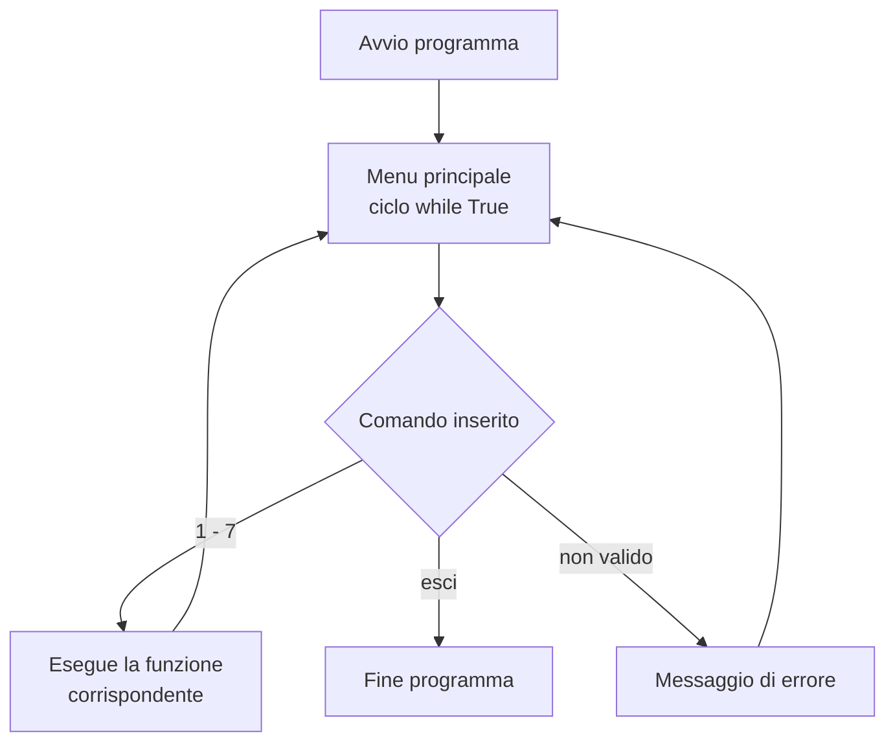
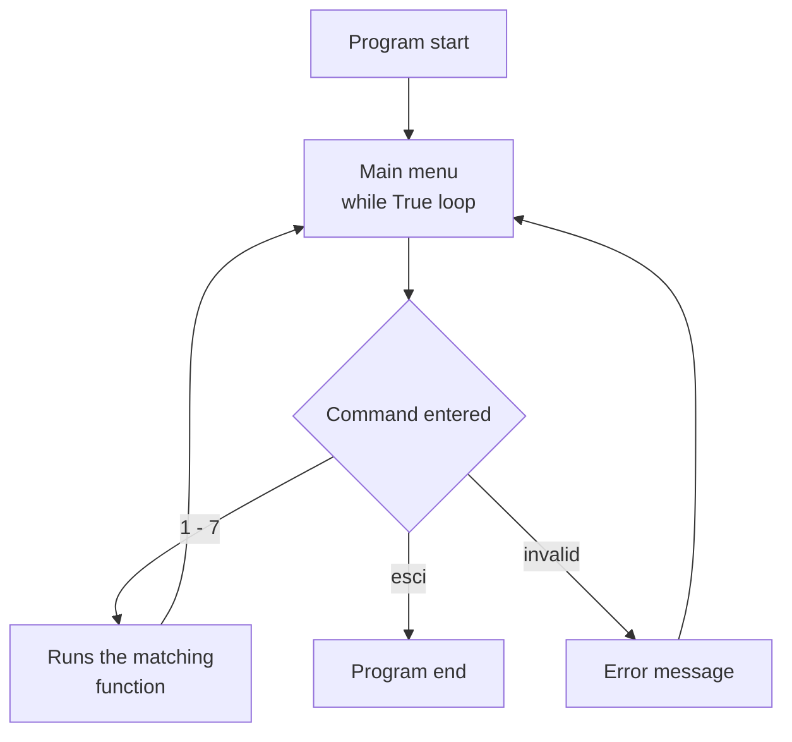

# 📚 BiblioSoftware

Software CLI in Python per la gestione dei libri di una biblioteca, sviluppato seguendo una specifica funzionale dettagliata.

**🌐 Language:** [Italiano](#italiano) | [English](#english)

---

## Italiano

### Descrizione

BiblioSoftware è un programma da terminale per gestire il catalogo di una biblioteca. Permette di aggiungere e rimuovere libri, verificarne la disponibilità, registrare prestiti, reintegrare copie e consultare statistiche sul catalogo. I libri sono salvati in un dizionario `{titolo: copie}`. L'utente interagisce tramite un menu testuale in un ciclo continuo, finché non digita il comando `esci`.

### Specifica del progetto

Il progetto è stato sviluppato a partire da una specifica funzionale, assegnata come esercizio nell'ambito del corso Python di [Gloria Longo](https://www.pythonaccelerator.it/). Il testo completo è disponibile nel file [Specifiche Progetto 1.pdf](Specifiche%20Progetto%201.pdf). Le funzioni richieste:

| Funzione | Opzione menu | Descrizione |
|---|---|---|
| `aggiungi_libro(titolo, copie)` | 1 | Aggiunge un nuovo libro, oppure incrementa le copie se il libro esiste già |
| `rimuovi_libro(titolo)` | 2 | Rimuove un libro dal catalogo; se non esiste stampa un errore |
| `verifica_disponibilita(titolo)` | 3 | Restituisce `True` se c'è almeno una copia, `False` se il libro non esiste o è esaurito |
| `prendi_in_prestito(titolo)` | 4 | Decrementa di 1 le copie; se il libro non esiste o è esaurito stampa un errore |
| `statistiche_biblioteca()` | 5 | Restituisce un dizionario con numero di titoli, copie totali e media copie per titolo |
| `visualizza_libri()` | 6 | Mostra tutti i libri con le copie disponibili, o un messaggio se il catalogo è vuoto |
| `restaurare_libro(titolo, copie)` | 7 | Aggiunge copie a un libro esistente; se non esiste stampa un errore |

### Flusso del programma



### Esempio di utilizzo

Sessione di prova con due libri:

| Comando | Input | Output |
|---|---|---|
| 6 | — | `Non ci sono libri in biblioteca` |
| 1 | `Il Nome della Rosa`, `3` | `Libro aggiunto` |
| 1 | `1984`, `2` | `Libro aggiunto` |
| 1 | `1984`, `abc` | `Inserisci un numero di copie valido` |
| 1 | `1984`, `-2` | `Numero di copie non valido` |
| 3 | `  IL NOME DELLA ROSA ` | `True` |
| 4 | `1984` (due volte) | `Il libro 1984 è stato correttamente decrementato` |
| 4 | `1984` (copie finite) | `ERRORE NELLA RICHIESTA` |
| 3 | `1984` | `False` |
| 7 | `1984`, `5` | `Quantita aggiornata` |
| 5 | — | `{'totale_libri': 2, 'copie_totali': 8, 'media_copie': 4.0}` |
| 2 | `Dune` | `ERRORE TITOLO NON VALIDO` |
| esci | — | `Grazie e arrivederci` |

### Processo di sviluppo

1. **Specifica ricevuta**: requisiti funzionali per le 7 funzioni del sistema
2. **Prima implementazione**: logica completa, con gli `input()` all'interno di ogni funzione e gestione errori tramite `try/except`
3. **Revisione**: confrontando codice e specifica sono emerse due differenze, poi corrette:
   - le funzioni ora hanno esattamente le firme della specifica, ad esempio `aggiungi_libro(titolo, copie)`, e la lettura dell'input è stata spostata nel menu
   - `statistiche_biblioteca()` ora restituisce la chiave `media_copie` richiesta, invece di `media_totale`

### Punti tecnici salienti

- Codice organizzato in funzioni con le stesse firme della specifica, una per ogni operazione richiesta
- Separazione tra logica e interfaccia: le funzioni lavorano sui parametri ricevuti, mentre la lettura dell'input avviene nel menu tramite due funzioni di supporto (`chiedi_titolo`, `chiedi_copie`)
- Titoli non sensibili a maiuscole e spazi (`.strip().lower()`): `1984`, ` 1984 ` e `IL NOME DELLA ROSA` vengono riconosciuti
- Validazione delle quantità: le copie devono essere un numero intero maggiore di zero (`try/except ValueError`)
- Gestione dei casi limite: libro inesistente, copie esaurite, catalogo vuoto (la media non genera una divisione per zero)
- Menu interattivo con ciclo continuo (`while True`) e uscita con `esci` (anche in maiuscolo) tramite `break`

### Come eseguirlo

```bash
python BiblioSoftware.py
```

Su alcuni sistemi il comando è `python3 BiblioSoftware.py`. Nessuna dipendenza esterna richiesta: basta la libreria standard di Python.

### Struttura della repository

| File | Contenuto |
|---|---|
| `BiblioSoftware.py` | Codice sorgente del programma |
| `Specifiche Progetto 1.pdf` | Specifica funzionale di partenza |
| `LICENSE` | Licenza MIT |

### Possibili sviluppi futuri

- Salvataggio permanente del catalogo su file o database **SQLite**
- Gestione degli utenti e dello storico dei prestiti
- Suite di test automatici

### Autore

**Antonino Todaro** — [GitHub](https://github.com/Isaccocaster)

---

## English

### Description

BiblioSoftware is a command-line program for managing a library's catalog. It lets you add and remove books, check availability, record loans, restore copies and view catalog statistics. Books are stored in a `{title: copies}` dictionary. The user interacts through a text menu in a continuous loop, until they type the `esci` command.

### Project specification

This project was built from a functional specification, assigned as an exercise within [Gloria Longo](https://www.pythonaccelerator.it/)'s Python course. The full text (in Italian) is available in [Specifiche Progetto 1.pdf](Specifiche%20Progetto%201.pdf). Required functions:

| Function | Menu option | Description |
|---|---|---|
| `aggiungi_libro(titolo, copie)` | 1 | Adds a new book, or increases the copies if the book already exists |
| `rimuovi_libro(titolo)` | 2 | Removes a book from the catalog; prints an error if it does not exist |
| `verifica_disponibilita(titolo)` | 3 | Returns `True` if at least one copy is available, `False` if the book does not exist or is out of stock |
| `prendi_in_prestito(titolo)` | 4 | Decreases copies by 1; prints an error if the book does not exist or is out of stock |
| `statistiche_biblioteca()` | 5 | Returns a dictionary with number of titles, total copies and average copies per title |
| `visualizza_libri()` | 6 | Lists every book with its available copies, or a message if the catalog is empty |
| `restaurare_libro(titolo, copie)` | 7 | Adds copies to an existing book; prints an error if it does not exist |

### Program flow



### Sample session

Test session with two books:

| Command | Input | Output |
|---|---|---|
| 6 | — | `Non ci sono libri in biblioteca` |
| 1 | `Il Nome della Rosa`, `3` | `Libro aggiunto` |
| 1 | `1984`, `2` | `Libro aggiunto` |
| 1 | `1984`, `abc` | `Inserisci un numero di copie valido` |
| 1 | `1984`, `-2` | `Numero di copie non valido` |
| 3 | `  IL NOME DELLA ROSA ` | `True` |
| 4 | `1984` (twice) | `Il libro 1984 è stato correttamente decrementato` |
| 4 | `1984` (no copies left) | `ERRORE NELLA RICHIESTA` |
| 3 | `1984` | `False` |
| 7 | `1984`, `5` | `Quantita aggiornata` |
| 5 | — | `{'totale_libri': 2, 'copie_totali': 8, 'media_copie': 4.0}` |
| 2 | `Dune` | `ERRORE TITOLO NON VALIDO` |
| esci | — | `Grazie e arrivederci` |

### Development process

1. **Specification received**: functional requirements for the system's 7 functions
2. **First implementation**: complete logic, with `input()` calls inside each function and `try/except` error handling
3. **Review**: comparing the code with the specification revealed two differences, which were then fixed:
   - the functions now have exactly the signatures in the specification, such as `aggiungi_libro(titolo, copie)`, and input reading was moved into the menu
   - `statistiche_biblioteca()` now returns the required `media_copie` key instead of `media_totale`

### Key technical points

- Code organized into functions with the same signatures as the specification, one for each required operation
- Separation of logic and interface: the functions work on the parameters they receive, while input is read in the menu through two helper functions (`chiedi_titolo`, `chiedi_copie`)
- Case- and whitespace-insensitive titles (`.strip().lower()`): `1984`, ` 1984 ` and `IL NOME DELLA ROSA` are all recognized
- Quantity validation: copies must be an integer greater than zero (`try/except ValueError`)
- Edge case handling: nonexistent book, no copies left, empty catalog (the average never divides by zero)
- Interactive menu with a continuous loop (`while True`) and exit via `esci` (case-insensitive) and `break`

### How to run it

```bash
python BiblioSoftware.py
```

On some systems the command is `python3 BiblioSoftware.py`. No external dependencies required: Python standard library only.

### Repository structure

| File | Content |
|---|---|
| `BiblioSoftware.py` | Program source code |
| `Specifiche Progetto 1.pdf` | Original functional specification |
| `LICENSE` | MIT license |

### Possible future improvements

- Persistent catalog storage on file or **SQLite** database
- User management and loan history
- Automated test suite

### Author

**Antonino Todaro** — [GitHub](https://github.com/Isaccocaster)
